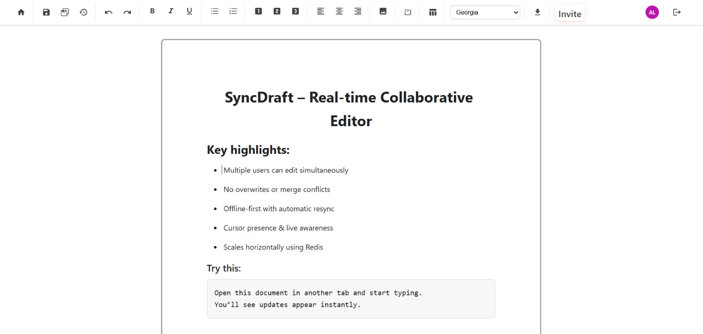

# SyncDraft  
### Real-time collaboration, without conflict

[](https://syncdraft.vercel.app/)
[](LICENSE)
[](https://github.com/Sachin1395/Distributed-Collaborative-Editor/issues)


🔗 **Live Demo:** https://syncdraft.vercel.app/  
👉 Open the same document in two tabs to see real-time collaboration.

---

## 📑 Table of Contents
- What is SyncDraft?
- Features
- Architecture Overview
- Tech Stack
- Live Demo
- Quick Start (Local Development)
- Environment Configuration
- Running Locally
- UI Preview
- Troubleshooting
- Contributing
- Roadmap
- License

---

## 🧠 What is SyncDraft?

SyncDraft is an **open-source, CRDT-powered collaborative editor** inspired by tools like Google Docs — but built to be **offline-first**, **conflict-free**, and **scalable by design**.

Instead of traditional locking or last-write-wins approaches, SyncDraft uses  
**Conflict-free Replicated Data Types (CRDTs)** to guarantee:

- No overwriting of edits  
- Automatic document convergence  
- Seamless collaboration even on unstable networks  

This project was built to **deeply understand real-time collaborative system internals** and ship a **production-grade system**, not just a demo.

---

## ✨ Features

- Real-time collaborative editing using **CRDTs (Yjs)**
- Conflict-free merging (no locks, no overwrites)
- Offline-first editing with automatic resynchronization
- Multi-user presence & cursor awareness
- Version snapshots & document history
- Secure authentication via Supabase
- Horizontally scalable WebSocket backend
- Metrics-ready architecture (Prometheus compatible)

---

## 🏗 Architecture Overview

```
Frontend (React + TipTap)
        ↓
Yjs CRDT Document State
        ↓
Hocuspocus WebSocket Server
        ↓
Redis (Awareness + Horizontal Scaling)
        ↓
Supabase (Auth + Metadata Persistence)
```

### Key Components
- **Yjs** – Shared document state and conflict resolution  
- **Hocuspocus** – Collaborative WebSocket sessions  
- **Redis / Upstash** – Horizontal scaling support  
- **Supabase** – Authentication and persistent metadata  

---

## 🧰 Tech Stack

### Frontend
- React
- TipTap
- Yjs

### Backend
- Node.js
- Hocuspocus
- WebSockets
- Redis (Upstash)

### Infrastructure
- Supabase (Auth & Database)
- Vercel (Frontend hosting)
- Render (Backend hosting)

---

## 🌍 Live Demo

👉 https://syncdraft.vercel.app/

Try this:
1. Create a document
2. Open it in two tabs or browsers
3. Watch edits sync in real time — conflict-free

---

## ⚡ Quick Start (Local Development)

### Prerequisites
- Node.js **18+**
- npm **9+**
- Redis instance (local or Upstash)
- Supabase project

---

### Clone the Repository
```bash
git clone https://github.com/Sachin1395/Distributed-Collaborative-Editor.git
cd Distributed-Collaborative-Editor
```

---

## 🔐 Environment Configuration

Create a `.env` file using `.env.example` as reference.

### `.env.example`
```env
# ---------- Frontend ----------
NEXT_PUBLIC_SUPABASE_URL=https://xyz.supabase.co
NEXT_PUBLIC_SUPABASE_ANON_KEY=public-anon-key

# ---------- Backend ----------
SUPABASE_SERVICE_ROLE_KEY=service-role-key
REDIS_URL=redis://:password@host:port
HOCUSPOCUS_WEBSOCKET_URL=ws://localhost:4000
PORT=4000
METRICS_PORT=4001
ALLOWED_ORIGINS=http://localhost:3000
```

⚠️ Copy `.env.example` → `.env` and fill in real credentials.

---

## ▶️ Running Locally

### Start Frontend
```bash
cd web
npm install
npm run dev
```

Runs at:
```
http://localhost:3000
```

---

### Start Backend (Hocuspocus Server)
```bash
cd server
npm install
npm run dev
# OR
node custom_server.js
```

Runs at:
```
http://localhost:4000
ws://localhost:4000
```

---

## 🧩 What to Expect Locally

| Service     | URL |
|------------|-----|
| Frontend   | http://localhost:3000 |
| Backend    | http://localhost:4000 |
| WebSocket  | ws://localhost:4000 |

If using **Upstash**, set `REDIS_URL` to your Upstash connection string.

---

## 🖥 UI Preview




---

## 🛠 Troubleshooting

### CORS Issues
Ensure:
```env
ALLOWED_ORIGINS=http://localhost:3000
```

### Redis Errors
- Upstash requires TLS
- Ensure credentials are correct

### WebSocket Not Connecting
- Backend must be running
- Check `HOCUSPOCUS_WEBSOCKET_URL`

---

## 🤝 Contributing

Contributions are welcome!

1. Fork the repository  
2. Create a feature branch  
3. Commit with clear messages  
4. Open a Pull Request  

Please ensure the project runs locally before submitting.

---

## 🗺 Roadmap

- Granular document permissions
- Comments & suggestions mode
- Export to PDF / Markdown
- Improved offline persistence
- End-to-end encryption (E2EE)

---

## 📄 License

This project is licensed under the **MIT License**.  
See the `LICENSE` file for details.

---

⭐ If this project helped you understand collaborative systems, consider starring the repo!
